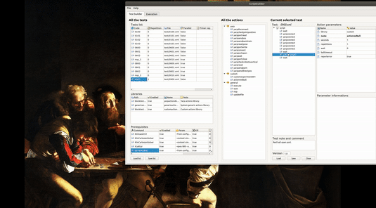

<!-- /TOC -->

# 1. CI Status


# 2. TOC

- [1. CI Status](#1-ci-status)
- [2. TOC](#2-toc)
- [3. Introduction](#3-introduction)
- [4. Installation](#4-installation)
	- [4.1. Prerequisite Linux](#41-prerequisite-linux)
	- [4.2. Prerequisite Windows](#42-prerequisite-windows)
	- [4.3. Installation and compilation](#43-installation-and-compilation)
- [5. Redball demo](#5-redball-demo)

# 3. Introduction
This repository has been created to contain all the custom plugin created by researchers.

# 4. Installation

Supported OS: Linux Ubuntu 18.10 and Windows 10.
Boost library version must be >1.64.


## 4.1. Prerequisite Linux

```bash
sudo apt-get install -y cmake libboost-all-dev
```
YARP see https://github.com/robotology/yarp

## 4.2. Prerequisite Windows

```bash
vcpkg install boost:x86-windows
```
YARP see https://github.com/robotology/yarp

In bash:
```bash
export blocktest_DIR=<path to your blocktest build dir>
```

## 4.3. Installation and compilation

In order to compile just execute the following commands in a bash
terminal.
```bash
git clone https://github.com/robotology/blocktest-custom-plugins     
cd blocktest-custom-plugins
mkdir build
cd build
ccmake ..
```
Make sure your CMAKE_INSTALL_PREFIX in ccmake is \<path to your blocktest build dir\>
Then:

```bash
make -j 4
make install
```

# 5. Redball demo
This test executes and checks the RedBallDemo application. 
In order to make this demo test work some prerequisited are needed.

```
$ git clone https://github.com/robotology/icub-basic-demos.git
$ mkdir icub-basic-demos/build && cd icub-basic-demos/build
$ ccmake .. && make install
```

Then some blocktest prerequisite in test.xml (or ScriptBuilder) must be activated:

```xml
	<prerequisite enabled="true" command="yarpserver" waitafter="5000" param="--silent" prefix="" kill="true" />
	<prerequisite enabled="true" command="iCub_SIM" waitafter="2000" param="" prefix="" kill="true" />
	<prerequisite enabled="true" command="yarprobotinterface" waitafter="2000" param="--context simCartesianControl --config no_legs.xml" prefix="" kill="true" />
	<prerequisite enabled="true" command="iKinGazeCtrl" waitafter="2000" param="--from configSim.ini" prefix="" kill="true" />
	<prerequisite enabled="true" command="iKinCartesianSolver" waitafter="2000" param="--context simCartesianControl --part right_arm" prefix="" kill="true" />
	<prerequisite enabled="true" command="iKinCartesianSolver" waitafter="2000" param="--context simCartesianControl --part left_arm" prefix="" kill="true" />
	<prerequisite enabled="true" command="iCubGui" waitafter="2000" param="--xpos 800 --ypos 80 --width 370" prefix="" kill="true" />
	<prerequisite enabled="true" command="demoRedBall" waitafter="2000" param="--from config-test.ini" prefix="" kill="true" />
```

Some blocktest library must be activated in test.xml (or ScriptBuilder):

```xml
	<library enabled="true" path="blocktestyarpplugins/libblocktestyarpplugins" name="yarpactiondepot" note="Yarp actions library" />
	<library enabled="true" path="genericactiondepot/genericactiondepot" name="genericactiondepot" note="System generic actions library" />
	<library enabled="true" path="blocktestcustomplugins/libblocktestcustomplugins" name="customactiondepot" note="Custom actions library" />

	<librarysettings enabled="true" name="genericactiondepot" />
	<librarysettings enabled="true" name="yarpactiondepot" wrappername="/right_leg /left_leg /torso /head /right_arm /left_arm" robotname="icubSim" netclock="false" />
	<librarysettings enabled="true" name="customactiondepot" />
```

As usual the test can be executed by (or by ScriptBuilder):

```bash
./blocktestrunner
```



